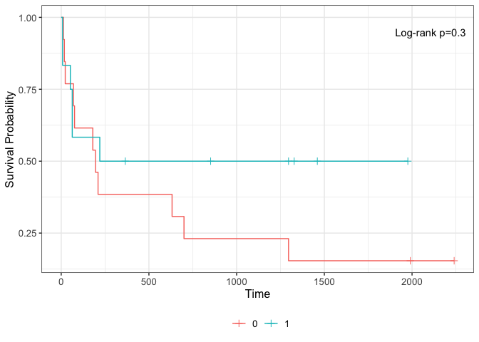

homework_3
================
Camille Okonkwo
2024-02-09

#### reading in data

``` r
hwdata1 = read_csv("data/hwdata1.csv")
```

    ## Rows: 686 Columns: 13
    ## ── Column specification ────────────────────────────────────────────────────────
    ## Delimiter: ","
    ## chr  (2): diagdate, recdate
    ## dbl (11): id, age, menopause, hormone, size, grade, nodes, prog_recp, estrg_...
    ## 
    ## ℹ Use `spec()` to retrieve the full column specification for this data.
    ## ℹ Specify the column types or set `show_col_types = FALSE` to quiet this message.

1.  Repeat the log-rank test between the survival curves of the two
    treatment groups in the myelomatosis example in this week’s lecture
    notes. Compute the Kaplan-Meier estimators and 95% CI of the
    survival functions of the two treatment groups (one Kaplan-Meier
    table for each group).

``` r
library(survival)

# create dataset
myelomatosis = data.frame(
  OBS = c(1:25),
  DUR = c(8, 180, 632, 852, 52, 2240, 220, 63, 195, 76, 70, 8, 13, 1990, 1976, 18, 700, 1296, 1460, 210, 63, 1328, 1296, 365, 23),
  STATUS = c(1, 1, 1, 0, 1, 0, 1, 1, 1, 1, 1, 1, 1, 0, 0, 1, 1, 0, 0, 1, 1, 0, 1, 0, 1),
  TREAT = c(1, 0, 0, 1, 1, 0, 1, 1, 0, 0, 0, 1, 0, 0, 1, 0, 0, 1, 1, 0, 1, 1, 0, 1, 0)
)

head(myelomatosis)
```

    ##   OBS  DUR STATUS TREAT
    ## 1   1    8      1     1
    ## 2   2  180      1     0
    ## 3   3  632      1     0
    ## 4   4  852      0     1
    ## 5   5   52      1     1
    ## 6   6 2240      0     0

``` r
#log-rank test
print(survdiff(Surv(DUR, STATUS)~TREAT, data = myelomatosis),
digits=5)
```

    ## Call:
    ## survdiff(formula = Surv(DUR, STATUS) ~ TREAT, data = myelomatosis)
    ## 
    ##          N Observed Expected (O-E)^2/E (O-E)^2/V
    ## TREAT=0 13       11   8.6624   0.63081    1.3126
    ## TREAT=1 12        6   8.3376   0.65539    1.3126
    ## 
    ##  Chisq= 1.3  on 1 degrees of freedom, p= 0.252

``` r
library(ggsurvfit)

#plot
survfit2(Surv(DUR, STATUS)~TREAT, data = myelomatosis) |> 
  ggsurvfit() +
  add_censor_mark() +
  add_pvalue(location = "annotation", 
             caption = "Log-rank {p.value}")
```

<!-- -->

``` r
#K-M table

km_table = survfit(Surv(DUR, STATUS) ~ TREAT, data = myelomatosis, conf.type = "log-log")

summary(km_table)
```

    ## Call: survfit(formula = Surv(DUR, STATUS) ~ TREAT, data = myelomatosis, 
    ##     conf.type = "log-log")
    ## 
    ##                 TREAT=0 
    ##  time n.risk n.event survival std.err lower 95% CI upper 95% CI
    ##    13     13       1    0.923  0.0739       0.5664        0.989
    ##    18     12       1    0.846  0.1001       0.5122        0.959
    ##    23     11       1    0.769  0.1169       0.4421        0.919
    ##    70     10       1    0.692  0.1280       0.3734        0.872
    ##    76      9       1    0.615  0.1349       0.3083        0.818
    ##   180      8       1    0.538  0.1383       0.2477        0.760
    ##   195      7       1    0.462  0.1383       0.1916        0.696
    ##   210      6       1    0.385  0.1349       0.1405        0.628
    ##   632      5       1    0.308  0.1280       0.0950        0.554
    ##   700      4       1    0.231  0.1169       0.0558        0.475
    ##  1296      3       1    0.154  0.1001       0.0248        0.388
    ## 
    ##                 TREAT=1 
    ##  time n.risk n.event survival std.err lower 95% CI upper 95% CI
    ##     8     12       2    0.833   0.108        0.482        0.956
    ##    52     10       1    0.750   0.125        0.408        0.912
    ##    63      9       2    0.583   0.142        0.270        0.801
    ##   220      7       1    0.500   0.144        0.208        0.736

2a. Generate a graph of the survival functions in the two hormone
therapy groups using `hwdata1`. Interpret the graph. (hint: What do you
observe on the difference of the survival functions between the two
groups?)

``` r
library(ggsurvfit)

survfit2(Surv(rectime, censrec) ~ hormone, data = hwdata1) |> 
ggsurvfit() +
add_censor_mark() +
add_pvalue(location="annotation",
caption="Log-rank {p.value}")
```

<!-- -->

Hormone group 1 and 2 initially have similar rates of survival, then
they become more different over time. Overall, we see that those in
group 2 have a higher probability of survival compared to group 1.

2b. Test whether the survival curves for the two hormone therapy groups
are the same using the log-rank test at α = 0.05. Give the null and
alternative hypothesis, test statistic, degrees of freedom, p-value, and
conclusion.

``` r
# log-rank test
print(survdiff(Surv(rectime, censrec) ~ hormone, data = hwdata1), 
      digits = 5)
```

    ## Call:
    ## survdiff(formula = Surv(rectime, censrec) ~ hormone, data = hwdata1)
    ## 
    ##             N Observed Expected (O-E)^2/E (O-E)^2/V
    ## hormone=1 440      205   180.34    3.3711    8.5648
    ## hormone=2 246       94   118.66    5.1237    8.5648
    ## 
    ##  Chisq= 8.6  on 1 degrees of freedom, p= 0.00343

#### Our hypotheses:

- H0 :S1(t) = S2(t), for all t ≤ τ
- Hα :at least one of the Sk (t) is different for some t ≤ τ

#### Test statistic:

- Q_log-rank = 8.6

#### Degree of freedom:

- df = 1

#### P-value:

- Pr(χ21 ≥ 8.6) = 0.00343 \< 0.05

#### Conclusion:

We reject H0 at the significance level 0.05. The survival curves for
patients in two hormone therapy groups are significantly different.

2c. Repeat the test in Question 2b using the Wilcoxon test. Does it lead
to the same conclusion? Briefly explain why the test statistic of the
Wilcoxon test is smaller than that of the log-rank test in this
application.

``` r
library(survMisc)
```

    ## 
    ## Attaching package: 'survMisc'

    ## The following object is masked from 'package:ggplot2':
    ## 
    ##     autoplot

``` r
fit = ten(survfit(Surv(rectime, censrec) ~ hormone, data = hwdata1))
comp(fit)
```

    ##                      Q         Var       Z pNorm
    ## 1          -2.4657e+01  7.0999e+01 -2.9263     4
    ## n          -1.1514e+04  1.5859e+07 -2.8913     5
    ## sqrtN      -5.2174e+02  3.1442e+04 -2.9424     3
    ## S1         -1.9118e+01  4.2030e+01 -2.9489     1
    ## S2         -1.9055e+01  4.1825e+01 -2.9464     2
    ## FH_p=1_q=1 -3.6357e+00  2.2480e+00 -2.4249     6
    ##               maxAbsZ        Var      Q pSupBr
    ## 1          2.5598e+01 7.0999e+01 3.0379      3
    ## n          1.1669e+04 1.5859e+07 2.9302      5
    ## sqrtN      5.3613e+02 3.1442e+04 3.0236      4
    ## S1         1.9700e+01 4.2030e+01 3.0386      2
    ## S2         1.9652e+01 4.1825e+01 3.0387      1
    ## FH_p=1_q=1 3.8839e+00 2.2480e+00 2.5905      6

``` r
knitr::kable(attributes(fit)$lrt[, c(1, 6:8)], "simple", digits = 4)
```

| W          |  chiSq |  df | pChisq |
|:-----------|-------:|----:|-------:|
| 1          | 8.5630 |   1 | 0.0034 |
| n          | 8.3595 |   1 | 0.0038 |
| sqrtN      | 8.6578 |   1 | 0.0033 |
| S1         | 8.6960 |   1 | 0.0032 |
| S2         | 8.6814 |   1 | 0.0032 |
| FH_p=1_q=1 | 5.8801 |   1 | 0.0153 |

From the K-M survival curve,we can see that the observed values between
hormone group 1 and 2 are similar at first, then become more different.
Because the log rank tests weighs the difference between observed and
expected number of events equally across all event times, and the
Wilcoxon test weighs the difference by the number of risk, we can expect
that the log-rank Q estimate will be larger than the Wilcoxon Q
estimate, and the log-rank p-value will be smaller than the Wilcoxon
p-value.

2d. Categorize the tumor size into four groups using the sample
quartiles (\< 20, \[20, 25), \[25, 35), and ≥ 35). Test whether the
survival functions are the same among the four groups using the
generalized log-rank test at α = 0.05. Give the null and alternative
hypothesis, test statistic, degrees of freedom, p-value, and conclusion.

``` r
hwdata1$size_group =
  cut(hwdata1$size, 
      c(min(hwdata1$size), 20, 25, 35,
        max(hwdata1$size)),
      include.lowest = TRUE, right = FALSE)

print(survdiff(Surv(rectime, censrec) ~ size_group, data = hwdata1),
      digits = 5)
```

    ## Call:
    ## survdiff(formula = Surv(rectime, censrec) ~ size_group, data = hwdata1)
    ## 
    ##                       N Observed Expected (O-E)^2/E (O-E)^2/V
    ## size_group=[3,20)   135       42   68.989 10.558275 13.839834
    ## size_group=[20,25)  152       70   67.561  0.088027  0.114314
    ## size_group=[25,35)  204       85   86.328  0.020438  0.028814
    ## size_group=[35,120] 195      102   76.121  8.797803 11.878858
    ## 
    ##  Chisq= 19.7  on 3 degrees of freedom, p= 2e-04

#### Our hypotheses:

- H0 :S1(t) = S2(t) = S3(t) = S4(t), for all t ≤ τ
- Hα :at least one of the Sk (t) is different for some t ≤ τ

#### Test statistic:

- Q_log-rank = 19.7

#### Degree of freedom:

- df = 3

#### P-value:

- Pr(χ23 ≥ 19.7) = 2e-04 \< 0.05

#### Conclusion:

We reject H0 at the significance level 0.05. The survival curves for
patients in the four groups divided by the sample quartiles of tumor
size are significantly different.
